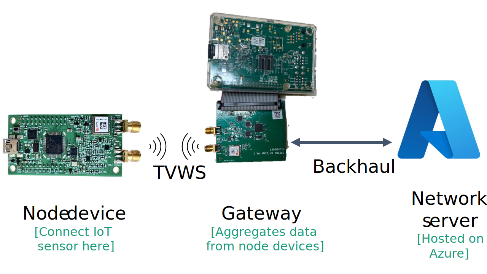

# FarmVibes.Connect

FarmVibes.Connect offers sample hardware designs and software tools to facilitate Internet of Things (IoT) device communication in the Television White Spaces (TVWS) spectrum. **Please note that FarmVibes.Connect does NOT grant any license for radio operations in the TVWS spectrum. Users must follow the guidelines set by the US Federal Communications Commission (FCC) or the relevant regulatory body to obtain the necessary license for operating radios in this spectrum.**

TV White Spaces are allocated but unused channels within the VHF and UHF broadcast TV bands, which can be utilized for both high and low bandwidth data transmission. Leveraging TVWS spectrum for narrowband IoT deployments offers several advantages over ISM bands. Since the TV band spectrum operates at lower frequencies than the 800/900 MHz ISM bands, it allows for longer-range connectivity—extending up to tens of miles—with non-line-of-sight operations and even through certain obstructions. This makes it possible to cover large areas with one or only a few gateways. Additionally, TVWS facilitates higher data rates for distant IoT clients, resulting in power savings on the devices. In sparsely populated regions, multiple unused TV channels are often available for TVWS devices, though the exact number varies by location. Collectively, these channels can provide significant bandwidth, enabling more simultaneous communication channels and increased traffic capacity. To learn more, please refer to our paper: [Whisper: IoT in the TV White Space Spectrum](https://www.usenix.org/system/files/nsdi22-paper-chakraborty.pdf).

FarmVibes.Connect is built on top of open-source tools based on the open LoRaWAN standard. It includes sample hardware designs and software patches to enable these tools to operate in the TVWS spectrum. The figure above presents a high-level, end-to-end diagram of FarmVibes.Connect's three major components: node device, gateway, and network server. The node device, mainly a radio, is directly connected to IoT sensors like those for soil moisture and temperature. It transmits packets containing sensor data on the air over the TVWS spectrum. You can find a guide to building the node hardware and software [here](/src/node/README.md). Next, the gateway collects packets from all node devices and forwards it to the network server through backhaul (e.g., WiFi, Ethernet, Cellular, etc.). For instructions on building the gateway hardware and software, refer [here](/src/gateway/README.md). Finally, the network server, typically hosted on the cloud, manages the entire network and stores the packets received from the nodes in cloud storage. You can find a guide to building and configuring the network server on Microsoft Azure [here](/src/lns/README.md).

## License
Please refer to [LICENSE](/LICENSE)

## Security
Please refer to [SECURITY.md](/SECURITY.md)

## Support
Please refer to [SUPPORT.md](/SUPPORT.md)

## Contributing

This project welcomes contributions and suggestions.  Most contributions require you to agree to a
Contributor License Agreement (CLA) declaring that you have the right to, and actually do, grant us
the rights to use your contribution. For details, visit https://cla.opensource.microsoft.com.

When you submit a pull request, a CLA bot will automatically determine whether you need to provide
a CLA and decorate the PR appropriately (e.g., status check, comment). Simply follow the instructions
provided by the bot. You will only need to do this once across all repos using our CLA.

This project has adopted the [Microsoft Open Source Code of Conduct](https://opensource.microsoft.com/codeofconduct/).
For more information see the [Code of Conduct FAQ](https://opensource.microsoft.com/codeofconduct/faq/) or
contact [opencode@microsoft.com](mailto:opencode@microsoft.com) with any additional questions or comments.

## Trademarks

This project may contain trademarks or logos for projects, products, or services. Authorized use of Microsoft 
trademarks or logos is subject to and must follow 
[Microsoft's Trademark & Brand Guidelines](https://www.microsoft.com/en-us/legal/intellectualproperty/trademarks/usage/general).
Use of Microsoft trademarks or logos in modified versions of this project must not cause confusion or imply Microsoft sponsorship.
Any use of third-party trademarks or logos are subject to those third-party's policies.
